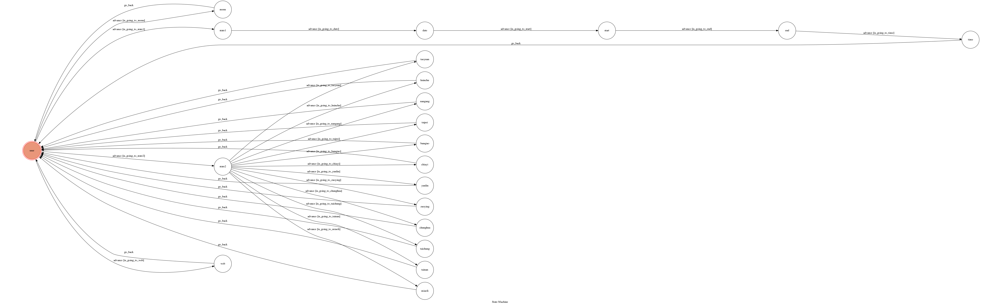

# Messenger Chatbot

Theory of Computation class final project

A Facebook messenger bot based on a finite state machine

## Setup

### Prerequisite
* Python 3
* Facebook Page and App
* HTTPS Server

#### Install Dependency
```sh
pip install -r requirements.txt
```

* pygraphviz (For visualizing Finite State Machine)

* beautifulsoup4 (For parse website data)

## Feature
* deploy on Heroku
* parse data from [台灣高鐵](http://www.thsrc.com.tw/index.html)

## Finite State Machine


## Usage
The initial state is set to `user`.

`user` state is triggered to `advance` to another state, and it will `go_back` to user `state` or go to other state after the bot replies corresponding message.

* user
	* Input: "嗨"
		* Go to `menu`
		* Reply: "哈囉～"
		* Reply: "我是高鐵服務機器人！"
		* Reply: "我有以下功能\n●時刻表查詢\n●車站資訊\n●官方網站\n"
		* Reply: "需要幫你什麼忙呢？？"
		* Go back to `user`

	* Input: "時刻表查詢"
		* Go to `state1`
		* Reply: "請問哪一天要搭車呢？"
		* Reply: "輸入格式為\nYYYY/MM/DD"

	* Input: "車站資訊"
		* Go to `state2`
		* Reply: "想要查詢哪個車站呢？"

	* Input: "官方網站"
		* Go to `web`
		* Reply: "官網再這裡唷～\nhttp://www.thsrc.com.tw/index.html"
		* Reply: "有需要其他幫忙再跟我說～"
		* Go back to `user`

* state1
	* Input: "yyyy/mm/dd"(ex:2018/12/19)
		* Go to `date`
		* Reply: "好的，搭車日期是： yyyy/mm/dd"
		* Reply: "那要從哪一站出發呢？"

* date
	* Input: "XX出發"(ex:台北出發)
		* Go to `start`
		* Reply: "好的，從XX出發"
		* Reply: "那要搭到哪一站呢？"

* start
	* Input: "搭到XX"(ex:搭到台南)
		* Go to `end`
		* Reply: "好的，搭到XX"
		* Reply: "那要幾點出發呢？"
		* Reply: "輸入格式為\nhh:mm\n記得要使用半形的冒號唷～"

* end
	* Input: "hh:mm"(ex:09:00)
		* Go to `time`
		* Reply: "好的，hh:mm出發"
		* Reply: "搜尋中，請稍等..."
		* Reply: "車次 1307\n出發 - 到達（行駛時間）\n09:01 - 10:47 ( 01:46 )..."
		* Reply: "有需要其他幫忙再跟我說～"
		* Go back to `user`

* state2
	* Input: "南港"
		* Go to `nangang`
		* Reply: "高鐵南港站\nhttp://www.thsrc.com.tw/tw/StationInfo/Prospect/2f940836-cedc-41ef-8e28-c2336ac8fe68"
		* Reply: "有需要其他幫忙再跟我說～"
		* Go back to `user`

	* Input: "台北"
		* Go to `taipei`
		* Reply: "高鐵台北站\nhttp://www.thsrc.com.tw/tw/StationInfo/prospect/977abb69-413a-4ccf-a109-0272c24fd490"
		* Reply: "有需要其他幫忙再跟我說～"
		* Go back to `user`
	
	* Input: "板橋"
		* Go to `banqiao`
		* Reply: "高鐵板橋站\nhttp://www.thsrc.com.tw/tw/StationInfo/Prospect/e6e26e66-7dc1-458f-b2f3-71ce65fdc95f"
		* Reply: "有需要其他幫忙再跟我說～"
		* Go back to `user`

	* Input: "桃園"
		* Go to `taoyuan`
		* Reply: "高鐵桃園站\nhttp://www.thsrc.com.tw/tw/StationInfo/Prospect/fbd828d8-b1da-4b06-a3bd-680cdca4d2cd"
		* Reply: "有需要其他幫忙再跟我說～"
		* Go back to `user`
	
	* Input: "新竹"
		* Go to `hsinchu`
		* Reply: "高鐵新竹站\nhttp://www.thsrc.com.tw/tw/StationInfo/Prospect/a7a04c89-900b-4798-95a3-c01c455622f4"
		* Reply: "有需要其他幫忙再跟我說～"
		* Go back to `user`

	* Input: "苗栗"
		* Go to `miaoli`
		* Reply: "高鐵苗栗站\nhttp://www.thsrc.com.tw/tw/StationInfo/Prospect/e8fc2123-2aaf-46ff-ad79-51d4002a1ef3"
		* Reply: "有需要其他幫忙再跟我說～"
		* Go back to `user`
	
	* Input: "台中"
		* Go to `taichung`
		* Reply: "高鐵台中站\nhttp://www.thsrc.com.tw/tw/StationInfo/Prospect/3301e395-46b8-47aa-aa37-139e15708779"
		* Reply: "有需要其他幫忙再跟我說～"
		* Go back to `user`

	* Input: "彰化"
		* Go to `chunghua`
		* Reply: "高鐵彰化站\nhttp://www.thsrc.com.tw/tw/StationInfo/Prospect/38b8c40b-aef0-4d66-b257-da96ec51620e"
		* Reply: "有需要其他幫忙再跟我說～"
		* Go back to `user`

	*Input: "雲林"
		* Go to `yunlin`
		* Reply: "高鐵雲林站\nhttp://www.thsrc.com.tw/tw/StationInfo/Prospect/5f4c7bb0-c676-4e39-8d3c-f12fc188ee5f"
		* Reply: "有需要其他幫忙再跟我說～"
		* Go back to `user`

	* Input: "嘉義"
		* Go to `chiayi`
		* Reply: "高鐵嘉義站\nhttp://www.thsrc.com.tw/tw/StationInfo/Prospect/60831846-f0e4-47f6-9b5b-46323ebdcef7"
		* Reply: "有需要其他幫忙再跟我說～"
		* Go back to `user`

	* Input: "台南"
		* Go to `taipei`
		* Reply: "高鐵台南站\nhttp://www.thsrc.com.tw/tw/StationInfo/Prospect/9c5ac6ca-ec89-48f8-aab0-41b738cb1814"
		* Reply: "有需要其他幫忙再跟我說～"
		* Go back to `user`

	* Input: "左營"
		* Go to `zuoying`
		* Reply: "高鐵左營站\nhttp://www.thsrc.com.tw/tw/StationInfo/Prospect/f2519629-5973-4d08-913b-479cce78a356"
		* Reply: "有需要其他幫忙再跟我說～"
		* Go back to `user`

## Reference
* [TOC-Project-2017](https://github.com/Lee-W/TOC-Project-2017) ❤️ [@Lee-W](https://github.com/Lee-W)
* [台灣高鐵](http://www.thsrc.com.tw/index.html)
* [Heroku](https://www.heroku.com/)
